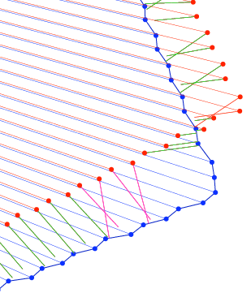

The C(anonical) Scan Matcher
============================

{:style="float: right; margin:1em;"}

### News ###

* Fall 2010: [CSM has been integrated and packaged][stack] for [ROS] by [Ivan Dryanovski][ivan].
    
### Overview ###

This is a pure C implementation of a very fast variation of ICP 
using a point-to-line metric optimized for range-finder scan matching.

The method is described in the paper:

    
A.C..
An ICP variant using a point-to-line metric.
In <em>Proceedings of the IEEE International Conference on Robotics and Automation (ICRA)</em>. Pasadena, CA, May 2008.
<a href="http://purl.org/censi/research/2008-icra-plicp.pdf"> pdf</a><a href="http://dx.doi.org/10.1109/ROBOT.2008.4543181">doi</a><a href="http://purl.org/censi/2007/plicp"> supp. material</a><a href="http://purl.org/censi/research/2008-icra-plicp-slides.pdf"> slides</a><a class='pub-ref-bibtex-link' onclick='javascript:$("#censi08plicp").toggle();' href='javascript:void(0)'>bibtex</a>
    <pre class='pub-ref-bibtex' id='censi08plicp' style='display: none;'>@inproceedings{censi08plicp,
        author = "Censi, Andrea",
        doi = "10.1109/ROBOT.2008.4543181",
        title = "An {ICP} variant using a point-to-line metric",
        url = "http://purl.org/censi/2007/plicp",
        booktitle = "Proceedings of the {IEEE} International Conference on Robotics and Automation ({ICRA})",
        year = "2008",
        month = "May",
        slides = "http://purl.org/censi/research/2008-icra-plicp-slides.pdf",
        address = "Pasadena, CA",
        pdf = "http://purl.org/censi/research/2008-icra-plicp.pdf",
        abstract = "This paper describes PLICP, an ICP (Iterative Closest/Corresponding Point) variant that uses a point-to-line metric, and an exact closed-form for minimizing such metric. The resulting algorithm has some interesting properties: it converges quadratically, and in a finite number of steps. The method is validated against vanilla ICP, IDC (Iterative Dual Correspondences), and MbICP (Metric-Based ICP) by reproducing the experiments performed in Minguez et al. (2006). The experiments suggest that PLICP is more precise, and requires less iterations. However, it is less robust to very large initial displacement errors. The last part of the paper is devoted to purely algorithmic optimization of the correspondence search; this allows for significant speed-up of the computation. The source code is available for download."
    }
    </pre>

An extremely fast and precise ICP variant for range-finder scan matching,
which converges quadratically in a finite number of steps.
<a href="http://purl.org/censi/2007/plicp">The implementation is available</a> and included also in ROS.

The package also contains two methods for estimating the
uncertainty of scan matching. Those are described in the following papers: 

### Download ###

* CSM can be download from GitHub (.zip package available) at the url:

  [http://github.com/AndreaCensi/csm](http://github.com/AndreaCensi/csm)

[stack]: http://www.ros.org/wiki/canonical_scan_matcher
[ivan]: http://robotics.ccny.cuny.edu/blog/People/Dryanovski
[ROS]: http://www.ros.org/
 

### Documentation / getting started ###

Please see the manual contained in "csm_manual.pdf". See below for a quick description.

**What is this.** I created this package:

- To have a well-documented reference implementation of [PL-ICP](http://purl.org/censi/2007/plicp). If you are only interested in the core algorithm of PL-ICP, a [separate concise implementation in C/Matlab/Ruby](http://purl.org/censi/2007/gpc) is available.

- To have a **trustworthy** scan matcher to be used in the experiments for some papers on [ICP covariance](http://purl.org/censi/2006/icpcov), [the Cramer-Rao bound for range finders](http://purl.org/censi/2006/accuracy), and [robot calibration](http://purl.org/censi/2007/calib).  For batch experiments, it's also useful that it's pretty fast.

- To have a collection of utilies for command line (UNIX-style) manipulation of laser data,
  and creating [beautiful maps][map-example] and animations.

The package contains also a Ruby wrapper for the C library, and additional Ruby and a Matlab implementations of the same algorithm. These are not as usable or documented as the C version.

**What it is NOT**: Note that this is not a full-featured SLAM solution: this only does pairwise scan-matching between scans (but it's really good at it!).
If you are looking for a more complete SLAM solution, please see the projects listed in the [OpenSLAM](http://www.openslam.org) page; in particular you can have a look at [GMapping]. 
Many pointers to other SLAM software can be found on the pages of the Euron SLAM summer schools: 
[2002 (Stockholm)](http://www.cas.kth.se/SLAM/),
[2004 (Toulouse)](http://www.laas.fr/SLAM/),
[2006 (Oxford)](http://www.robots.ox.ac.uk/~SSS06/Website/index.html).
Other related projects are [Carmen] and [Stage].

[map-example]: ../plicp/laserazosSM3.log.pdf

[gmapping]: http://www.openslam.org/gmapping.html
[carmen]: http://carmen.sourceforge.net/
[stage]: http://playerstage.sourceforge.net/

-----------

Please link to this page using the url <http://purl.org/censi/2007/csm>.